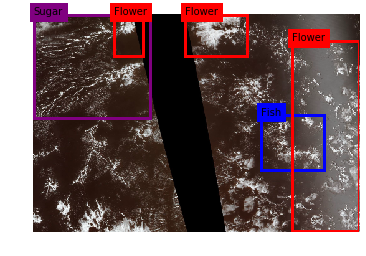
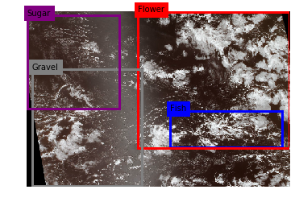
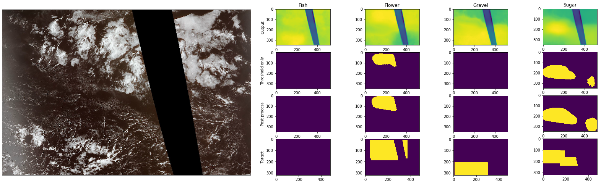

# Understanding Clouds from Satellite Images

Multiclass segmentation of cloud patterns in satellite images.

|  | |
|:---:|:---:|

Code for Kaggle's [Understanding Clouds from Satellite Images Challenge](https://www.kaggle.com/c/understanding_cloud_organization). This solution has scored 0.65455 (Dice) on private leaderboard and ranked 161st place (top 11%). 

## Description
* PyTorch
* Ensemble of 4 pretrained models from [Segmentation Models](https://github.com/qubvel/segmentation_models.pytorch) (Unet, FPN) and [FastFCN](https://github.com/wuhuikai/FastFCN) (EncNet, DeepLabV3)
* Optimizer: [RAdam]( https://github.com/LiyuanLucasLiu/RAdam/blob/master/radam.py) (lr=0.005)
* Metric: Dice
* Loss: Focal + log dice
* Scheduler: ReduceLROnPlateau

* Preprocessing: Resize from 1400x2100 to 320x480
* Postprocessing: Threshold, Remove small masks, Draw convex hull mask
* [Albumentations](https://github.com/albumentations-team/albumentations) augmentations
* Trained on 80% of data (stratified based on mask areas)
* 35 epochs, models with best Dice score were selected for ensemble

## Results
Local dice: 0.64465 
Public leaderboard score: 0.65574 
**Private leaderboard score: 0.65455**

### Model raw output dice
|Model|Backbone|Local Dice|
|---|---|:---:|
|FPN|efficientnet-b4|0.46|
|Unet|efficientnet-b4|0.444|
|EncNet|resnet50|0.445|
|DeepLabV3|resnet50|0.436|

### Class dice score after ensemble and postprocessing
|Class|Fish|Flower|Gravel|Sugar|
|---|:---:|:---:|:---:|:---:|
|Local Dice|0.578186|0.750014|0.642398|0.608013|

#### Example of mask and model output

